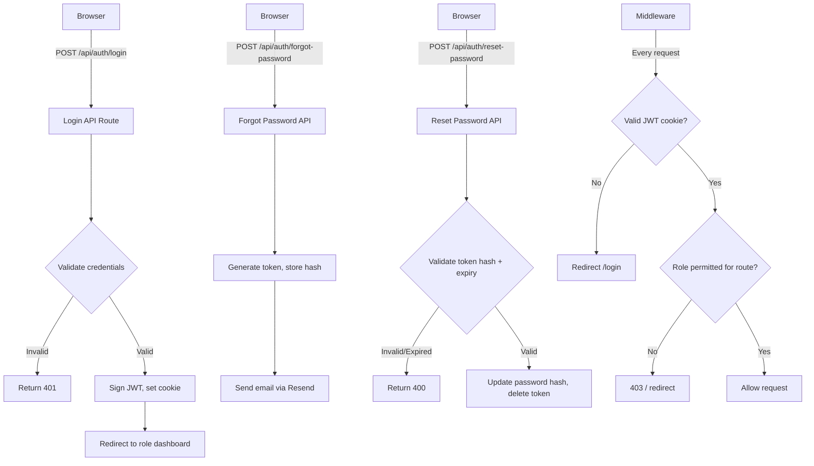

# Design Document: Custom Authentication

## Overview

This design replaces the existing Clerk-based authentication with a fully custom, credential-based authentication system built on top of the existing Neon PostgreSQL database. The system uses bcrypt for password hashing, cryptographically secure tokens for password reset flows, and HTTP-only cookies for session management via JWT. Resend handles all transactional email delivery. There are no self-registration flows — all users are created by administrators.

The three user tiers (Super Admin, Care Home Admin, Staff) each receive role-appropriate redirects after login and are subject to route-level access control enforced in Next.js middleware.

---

## Architecture



---

## Components and Interfaces

### API Routes

| Route | Method | Description |
|---|---|---|
| `/api/auth/login` | POST | Validates credentials, issues JWT session cookie |
| `/api/auth/logout` | POST | Clears session cookie |
| `/api/auth/forgot-password` | POST | Generates reset token, sends email |
| `/api/auth/reset-password` | POST | Validates token, updates password |
| `/api/auth/verify-token` | GET | Validates a reset/setup token before showing the form |

### Pages

| Route | Description |
|---|---|
| `/login` | Main login page (replaces `/sign-in`) |
| `/forgot-password` | Email submission form |
| `/reset-password` | New password form (token via query param) |

### Library Modules

| File | Responsibility |
|---|---|
| `lib/auth.ts` | Session creation/validation, JWT signing/verification, role helpers |
| `lib/tokens.ts` | Token generation, hashing, storage, validation |
| `lib/email.ts` | Resend email sending functions |
| `lib/password.ts` | bcrypt hash and compare helpers |

### Middleware

`middleware.ts` is rewritten to:
1. Read the `session` HTTP-only cookie
2. Verify the JWT
3. Attach decoded user payload to request headers
4. Enforce route-level role permissions

---

## Data Models

### Database Changes

The existing `users` table already has the required columns. Two additions are needed:

```sql
-- Add password hash column
ALTER TABLE users ADD COLUMN IF NOT EXISTS password_hash TEXT;

-- Password reset tokens table
CREATE TABLE IF NOT EXISTS password_reset_tokens (
  id UUID PRIMARY KEY DEFAULT uuid_generate_v4(),
  user_id UUID NOT NULL REFERENCES users(id) ON DELETE CASCADE,
  token_hash TEXT NOT NULL,
  expires_at TIMESTAMP WITH TIME ZONE NOT NULL,
  created_at TIMESTAMP WITH TIME ZONE DEFAULT NOW()
);

CREATE INDEX IF NOT EXISTS idx_prt_user_id ON password_reset_tokens(user_id);
```

### Session JWT Payload

```typescript
interface SessionPayload {
  userId: string
  email: string
  role: UserRole
  careHomeId: string | null
  iat: number
  exp: number
}
```

### Token Flow

```
1. crypto.randomBytes(32) → raw token (hex string, 64 chars)
2. SHA-256 hash of raw token → stored in DB
3. Raw token → sent in email link as query param
4. On validation: SHA-256(presented token) === stored hash AND expires_at > NOW()
```

---

## Correctness Properties

*A property is a characteristic or behavior that should hold true across all valid executions of a system — essentially, a formal statement about what the system should do. Properties serve as the bridge between human-readable specifications and machine-verifiable correctness guarantees.*


Property 1: Login session round-trip
*For any* active user with a valid email and bcrypt-hashed password, calling the login function with the correct credentials should return a session payload whose `userId`, `email`, `role`, and `careHomeId` match the user record exactly.
**Validates: Requirements 1.1, 1.5**

Property 2: Login error message uniformity
*For any* login attempt — whether the email does not exist or the password is incorrect — the error message returned by the login function should be identical, preventing user enumeration.
**Validates: Requirements 1.2, 1.3**

Property 3: Login input validation rejects blank fields
*For any* input where email or password is an empty string or composed entirely of whitespace, the input validation function should return a non-empty errors object and not proceed to credential checking.
**Validates: Requirements 1.4**

Property 4: JWT round-trip and tamper detection
*For any* valid session payload, signing it to a JWT and then verifying that JWT should return an equivalent payload. For any tampered or malformed JWT string, verification should return null.
**Validates: Requirements 1.5, 5.2**

Property 5: New user creation initial state
*For any* valid user creation input, the resulting user record should have `is_verified = false` and `password_hash = null`.
**Validates: Requirements 2.1**

Property 6: Token expiry window on creation
*For any* generated password reset token, the stored `expires_at` value should be strictly greater than the current time and within the expected window (1 hour for reset, 24 hours for setup).
**Validates: Requirements 2.2, 4.2**

Property 7: Password hash round-trip
*For any* password string that passes the minimum requirements, hashing it with bcrypt and then calling `bcrypt.compare` with the original string and the hash should return `true`. Calling `bcrypt.compare` with any different string should return `false`.
**Validates: Requirements 3.2, 4.4**

Property 8: Password validation rejects weak passwords
*For any* password string that is shorter than 8 characters, lacks an uppercase letter, or lacks a digit, the password validation function should return a non-empty errors array.
**Validates: Requirements 3.4**

Property 9: Forgot-password response uniformity
*For any* email address — whether registered or not — the forgot-password handler should return the same response shape and HTTP status code, preventing user enumeration.
**Validates: Requirements 4.1**

Property 10: Role-based access control decisions
*For any* combination of user role and protected route path, the access control function should return `allow` only when the role is in the permitted set for that route, and `deny` otherwise.
**Validates: Requirements 6.2**

Property 11: Token uniqueness
*For any* two independently generated password reset tokens, the raw token strings should not be equal.
**Validates: Requirements 7.1**

Property 12: Token validation round-trip
*For any* generated token that has not expired, presenting the raw token to the validation function should return the associated user ID. Presenting an incorrect token string or an expired token should return null.
**Validates: Requirements 7.2, 7.3**

Property 13: Token deletion after use
*For any* valid token that is successfully consumed by the reset-password flow, a subsequent attempt to validate the same raw token should return null.
**Validates: Requirements 7.4**

---

## Error Handling

| Scenario | HTTP Status | Response |
|---|---|---|
| Invalid credentials | 401 | `{ error: "Invalid email or password" }` |
| Inactive account | 401 | `{ error: "Your account has been disabled. Contact your administrator." }` |
| Expired/used token | 400 | `{ error: "This link has expired or has already been used." }` |
| Duplicate email on user creation | 409 | `{ error: "A user with this email already exists." }` |
| Weak password | 422 | `{ errors: { password: "..." } }` |
| Missing required fields | 422 | `{ errors: { field: "..." } }` |
| Unauthorized route access | 403 | Redirect to `/403` or role dashboard |
| Unauthenticated route access | 401 | Redirect to `/login` |

All error responses from the login endpoint use the same generic message for both "email not found" and "wrong password" to prevent user enumeration.

---

## Testing Strategy

### Property-Based Testing

The property-based testing library for this project is **fast-check** (TypeScript-native, works in Node.js/Jest/Vitest environments).

Each property-based test must:
- Run a minimum of 100 iterations (`numRuns: 100`)
- Be tagged with a comment in the format: `// Feature: custom-authentication, Property N: <property text>`
- Reference the correctness property number from this design document
- Test pure functions where possible (token generation, password hashing, JWT signing, validation logic)

### Unit Tests

Unit tests cover:
- Specific examples for error paths (duplicate email, inactive account, expired token)
- Integration points between `lib/auth.ts`, `lib/tokens.ts`, and `lib/password.ts`
- Middleware route-matching logic with concrete role/route examples

### Test File Structure

```
lib/
  __tests__/
    auth.test.ts        # JWT round-trip, session creation, role helpers
    tokens.test.ts      # Token generation, hashing, validation, deletion
    password.test.ts    # bcrypt round-trip, validation rules
    access-control.test.ts  # RBAC decisions across role/route combinations
```

### Testing Framework

- **Test runner**: Vitest (already compatible with Next.js)
- **PBT library**: fast-check
- **Assertion library**: Vitest built-in (`expect`)
