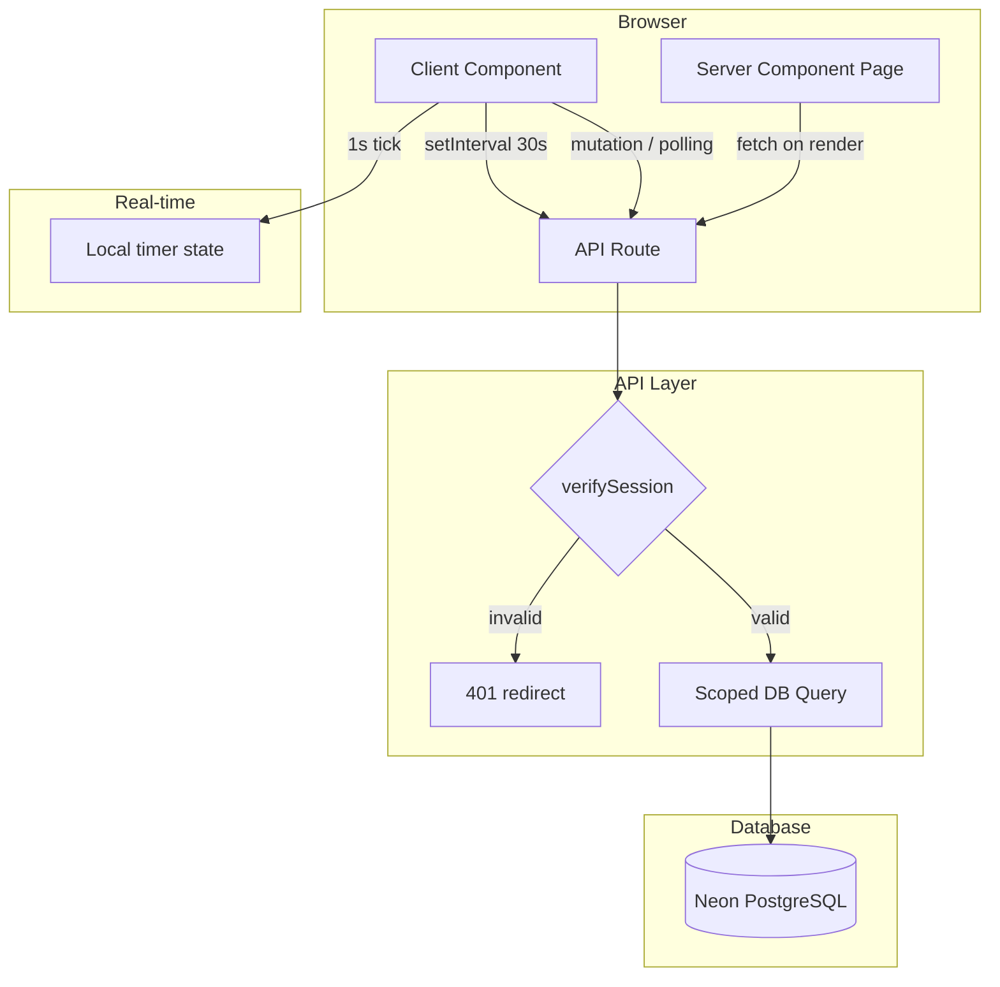

# Design Document: Hadsul Care Home Workforce Platform

## Overview

This design wires the existing UI shells to a real backend. Every page currently renders hardcoded mock data — this design replaces all of that with typed API routes backed by the Neon PostgreSQL database, enforces tenant isolation at the query layer, adds real-time clock-in/out functionality, and makes the sidebar and header reflect the authenticated user's identity and role.

The architecture follows Next.js App Router conventions: Server Components fetch data directly where possible, Client Components call API routes for mutations and real-time updates. All API routes verify the session JWT and scope queries by `care_home_id`.

---

## Architecture



---

## Components and Interfaces

### API Routes

| Route | Method | Auth | Description |
|---|---|---|---|
| `/api/dashboard/stats` | GET | Any admin | KPI summary scoped by role |
| `/api/dashboard/activity` | GET | Any admin | Recent clock events (20 most recent) |
| `/api/care-homes` | GET | Super Admin | List all care homes with stats |
| `/api/care-homes` | POST | Super Admin | Create a new care home |
| `/api/care-homes/[id]` | GET | Super Admin | Single care home detail |
| `/api/care-homes/[id]` | PATCH | Super Admin | Update care home |
| `/api/staff` | GET | Admin | List staff (scoped by care_home_id) |
| `/api/staff` | POST | Admin | Create staff member + send welcome email |
| `/api/staff/[id]` | GET | Admin | Staff profile + clock history |
| `/api/staff/[id]` | PATCH | Admin | Update staff member |
| `/api/clock/status` | GET | Staff/Admin | Current clock status for user |
| `/api/clock/in` | POST | Staff | Clock in |
| `/api/clock/out` | POST | Staff | Clock out |
| `/api/clock/live` | GET | Admin | All currently clocked-in staff for care home |

### Pages

| Route | Role | Description |
|---|---|---|
| `/dashboard` | All | Role-scoped KPI dashboard |
| `/dashboard/care-homes` | Super Admin | Care homes list + add/edit |
| `/dashboard/staff` | Admin | Staff list + add/edit |
| `/dashboard/staff/[id]` | Admin | Staff profile detail |
| `/dashboard/clock` | Staff | Clock in/out widget + history |
| `/dashboard/users` | Super Admin | User management |

### Shared Library Modules

| File | Responsibility |
|---|---|
| `lib/auth.ts` | Session verification, `getCurrentUser`, role helpers |
| `lib/db.ts` | Neon SQL client |
| `lib/email.ts` | Welcome + reset emails via Resend |
| `lib/tokens.ts` | Password reset token generation |

---

## Data Models

### TypeScript Types (shared in `lib/types.ts`)

```typescript
export interface CareHome {
  id: string
  name: string
  address: string | null
  city: string | null
  postcode: string | null
  phone: string | null
  email: string | null
  cqc_rating: string | null
  cqc_registration_number: string | null
  capacity: number
  status: 'active' | 'inactive' | 'suspended'
  created_at: string
  // Computed/joined
  staff_count?: number
  clocked_in_count?: number
}

export interface StaffMember {
  id: string
  care_home_id: string | null
  email: string
  first_name: string
  last_name: string
  phone: string | null
  role: UserRole
  job_title: string | null
  department: string | null
  hourly_rate: number | null
  contract_hours: number | null
  contract_type: 'full_time' | 'part_time' | 'zero_hours' | 'bank' | 'agency' | null
  is_active: boolean
  is_verified: boolean
  // Computed
  is_clocked_in?: boolean
  clock_in_time?: string | null
  hours_today?: number
  hours_this_week?: number
}

export interface ClockRecord {
  id: string
  user_id: string
  care_home_id: string
  clock_in_time: string
  clock_out_time: string | null
  total_hours_worked: number | null
  status: 'clocked_in' | 'on_break' | 'clocked_out' | 'adjusted'
  // Joined
  staff_name?: string
  staff_role?: string
}

export interface DashboardStats {
  total_staff: number
  clocked_in_now: number
  late_today: number
  hours_today: number
  // Super admin only
  total_care_homes?: number
  // Care home admin only
  expected_not_in?: number
}
```

### Database Queries Pattern

All API routes follow this pattern:

```typescript
// 1. Verify session
const user = await getCurrentUser(request)
if (!user) return NextResponse.json({ error: 'Unauthorized' }, { status: 401 })

// 2. Scope query by role
const rows = user.role === 'super_admin'
  ? await sql`SELECT * FROM users`
  : await sql`SELECT * FROM users WHERE care_home_id = ${user.care_home_id}`
```

---

## Correctness Properties

*A property is a characteristic or behavior that should hold true across all valid executions of a system — essentially, a formal statement about what the system should do. Properties serve as the bridge between human-readable specifications and machine-verifiable correctness guarantees.*

Property 1: Tenant isolation on staff queries
*For any* API request from a Care Home Admin, the staff list returned should contain only users whose `care_home_id` matches the admin's own `care_home_id` — never users from other care homes.
**Validates: Requirements 3.2, 9.4**

Property 2: Tenant isolation on clock records
*For any* API request to `/api/clock/live` from a Care Home Admin, all returned clock records should have a `care_home_id` equal to the admin's `care_home_id`.
**Validates: Requirements 5.1, 9.4**

Property 3: Duplicate clock-in prevention
*For any* staff member who already has an open clock record (clock_in_time set, clock_out_time null), a subsequent clock-in request should be rejected and the number of open clock records for that user should remain exactly 1.
**Validates: Requirements 4.4**

Property 4: Clock-out closes the open record
*For any* staff member with exactly one open clock record, clocking out should set clock_out_time to a value greater than clock_in_time and result in zero open clock records for that user.
**Validates: Requirements 4.2**

Property 5: Late detection threshold
*For any* clock-in where the actual clock_in_time is more than 15 minutes after the scheduled shift start_time, the resulting clock record should be marked as late.
**Validates: Requirements 4.5, 5.4**

Property 6: Hours calculation correctness
*For any* completed clock record, total_hours_worked should equal (clock_out_time - clock_in_time) expressed in decimal hours, within a tolerance of 0.01 hours.
**Validates: Requirements 5.5, 7.3**

Property 7: Care home stats aggregation
*For any* care home, the `clocked_in_count` returned by the dashboard stats API should equal the count of open clock records (clock_out_time IS NULL) for users in that care home.
**Validates: Requirements 5.1, 6.2**

Property 8: Super admin sees all care homes
*For any* super admin request to `/api/care-homes`, the response should include every care home in the database regardless of status.
**Validates: Requirements 1.5, 6.1**

Property 9: Duplicate CQC registration rejection
*For any* two care homes in the database, their `cqc_registration_number` values should be distinct (no two homes share the same CQC number).
**Validates: Requirements 1.4**

Property 10: Staff creation sets unverified state
*For any* staff member created via the POST `/api/staff` route, the resulting record should have `is_verified = false` and `password_hash = null`.
**Validates: Requirements 3.1**

---

## Error Handling

| Scenario | HTTP Status | Response |
|---|---|---|
| Unauthenticated request | 401 | `{ error: "Unauthorized" }` |
| Insufficient role | 403 | `{ error: "Forbidden" }` |
| Resource not found | 404 | `{ error: "Not found" }` |
| Duplicate CQC number | 409 | `{ error: "A care home with this CQC number already exists" }` |
| Duplicate email | 409 | `{ error: "A user with this email already exists" }` |
| Already clocked in | 409 | `{ error: "You are already clocked in" }` |
| Not clocked in (on clock-out) | 400 | `{ error: "No active clock record found" }` |
| Validation failure | 422 | `{ errors: { field: "message" } }` |
| DB error | 500 | `{ error: "Internal server error" }` (logged server-side) |

---

## Testing Strategy

### Property-Based Testing

Library: **fast-check** (already installed as dev dependency)
Runner: **Vitest** (already configured)

Each property-based test must:
- Run a minimum of 100 iterations (`numRuns: 100`)
- Be tagged: `// Feature: workforce-platform, Property N: <property text>`
- Test pure business logic functions where possible (hours calculation, late detection, tenant scoping)

### Unit Tests

Unit tests cover:
- Specific API route error paths (duplicate CQC, already clocked in, wrong role)
- Tenant isolation: a care home admin cannot retrieve another home's staff
- Hours calculation edge cases (midnight crossover, exactly 15-minute threshold)

### Test File Structure

```
lib/
  __tests__/
    workforce.test.ts       # Hours calc, late detection, tenant isolation logic
    clock.test.ts           # Clock-in/out state machine properties
    care-homes.test.ts      # CQC uniqueness, stats aggregation
```
